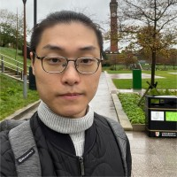

Sumin Han
===

_last updated: Nov 10th, 2023_

Sumin Han, Ph.D. Candidate, [CDSN Lab](http://cds.kaist.ac.kr/) (Advisor: Dongman Lee)

School of Computing, Korea Advanced Institute of Science and Technology (KAIST)

*   Email: hsm6911 (at) kaist.ac.kr
*   Linkedin: [https://www.linkedin.com/in/sumin-han-cs/](https://www.linkedin.com/in/sumin-han-cs/)
*   Github: [https://github.com/SuminHan](https://github.com/SuminHan)
*   Blog: [https://csds.tistory.com](https://csds.tistory.com/)

## Education

*   18'~ Integrated master's/doctoral program (doctoral), KAIST - School of Computing
*   18' B.S. in KAIST - School of Computing, Advanced Major
*   13' Korea Science Academy of KAIST

## Research Interests

Urban Computing, Spatio-temporal Deep Neural Network, Road2Vec/Region2Vec, Urban Simulation

## Publications

### International Publications

#### 2023
- Sumin Han, Youngjun Park, Sonia Sabir, Jisun An, and Dongman Lee, “*Improving Real Estate Appraisal with POI Integration and Areal Embedding*,”, [Arxiv](https://arxiv.org/abs/2311.11812)
- Sumin Han, Youngjun Park, Minji Lee, Jisun An, and Dongman Lee, “Enhancing Spatio-temporal Traffic Prediction through Urban Human Activity Analysis,”  32nd ACM International Conference on Information and Knowledge Management (acceptance rate 24%) [Paper](https://dl.acm.org/doi/10.1145/3583780.3614867) [Code](https://github.com/SuminHan/Traffic-UAGCRNTF)
- Youngjun Park, Sumin Han, Jisun An, and Dongman Lee “*Encoding Urban Trajectory as a Language: Deep Learning Insights for Human Mobility Pattern*“, The paper will be presented at the Association of Collegiate Schools of Planning (ACSP) conference 2023 in Chicago, IL. [Paper](https://dofeature.github.io/documents/2023_ACSP.pdf) [Code](https://github.com/SuminHan/OD-astar)

#### 2020

- Sumin Han, Dasom Hong, and Dongman Lee, “Exploring Commercial Gentrification using Instagram Data”, The 2020 IEEE/ACM International Conference on Advances in Social Network Analysis and Mining (ASONAM), December. 2020. [link](https://suminhan.github.io/087_146_557.pdf)
- Sumin Han, Kinam Park, and Dongman Lee, “Discovering Daily POI Exploitation using LTE Cell Tower Access Traces in Urban Environment”, International Conference on Social Informatics 2020, October. 2020. [link](https://link.springer.com/chapter/10.1007/978-3-030-60975-7_7)
- Dongmin Kim, Sumin Han, Heesuk Son, and Dongman Lee, “Human Activity Recognition using Semi-Supervised Multi-Modal DEC for Instagram Data”, PAKDD 2020. [link](https://link.springer.com/chapter/10.1007/978-3-030-47426-3_67)

### Domestic Publications

#### 2022

- 김창희, 한수민, 이동만, 지하철 이용패턴을 통한 역단위 장소성 추론, KCC 2022
- Cao Long, Sumin Han, Dongman Lee, 인스타그램 게시물의 장면 그래프 적용을 통한 멀티모달 지도학습 기반 인간 활동 인식율 향상, KCC 2022

#### 2021

- 김수빈, 한수민, and 이동만. "서울시의 토지 이용에 따른 도로의 차량 속도의 상관관계 분석." *한국정보과학회 학술발표논문집*
 (2021): 119-121. [link](https://www.dbpia.co.kr/journal/articleDetail?nodeId=NODE10582849)
- Marciniak, Zofia, Sumin Han, and Dongman Lee. "Understanding the impact of the Weather on Human Mobility via LTE Access Traces in Seoul Districts." *한국 HCI 학회 학술대회*
 (2021): 615-618. [link](https://www.dbpia.co.kr/journal/articleDetail?nodeId=NODE10530300)

#### 2020

- 정종구, 한수민, and 이동만. "인스타그램에서 나타나는 인간 활동 패턴의 연간 변화 분석(Analysis of Annual Changes in Human Activity Patterns on Instagram)." *한국 HCI 학회 학술대회*
 (2020): 723-726. [link](https://www.dbpia.co.kr/journal/articleDetail?nodeId=NODE10402833)
- 안정미, 한수민, and 이동만. "인스타그램 데이터를 활용한 장소성 분석 및 시각화(Visualizing a Sense of Place Using Instagram Data)." *한국 HCI 학회 학술대회*
 (2020): 929-933. [link](https://www.dbpia.co.kr/journal/articleDetail?nodeId=NODE10402880)

#### 2018

- 한수민, and 김명호. "베이지안 개인화 순위 방법 기반 대용량 이종 네트워크에서의 효율적인 랜덤 워크 순위 계산(Random Walk with Restart on a Large-scale Heterogeneous Network Based on the Bayesian Personalized Ranking)." *한국정보과학회 학술발표논문집* (2018): 889-891.APA [link](https://www.dbpia.co.kr/journal/articleDetail?nodeId=NODE07613785)

## Experiences
- Deep Urban: [https://deepurban.kaist.ac.kr/](https://deepurban.kaist.ac.kr/) (Jan, 2023 ~)
    - Urban Data and Code Sharing Platform (Main Server Manager).
    - Urban Flow [https://cdsnlab.github.io/urbanflow-documentation/](https://cdsnlab.github.io/urbanflow-documentation/): Ongoing project for providing easy API for urban researchers.
- Satrec Initiative Co., Ltd. (Jul 2017 - Aug 2017 · 2 mos)
    - Parallel Computing Framework Design
    - **Skills:** Parallel Computing · MPI · CUDA · docker · CentOS
- 로톡 LAWTALK (Mar 2014 - May 2014 · 3 mos): Software Engineer
    - Full-time SW developer
    - **Skills:** JavaScript · HTML · PHP · Git · Node.js · MongoDB · Vim · Express.js · AngularJS · Agile Methodologies · Firebase

## Hobbies

Cooking, Chess ([sucern@chess.com](https://www.chess.com/member/sucern))

## Favorite Books

- [The World as Will and Representation — Arthur Schopenhauer](https://en.wikisource.org/wiki/The_World_as_Will_and_Representation)

# Curriculum Vitae
- [Academic CV](https://github.com/SuminHan/suminhan.github.io/raw/master/_Academic_CV__Sumin_Resume_20230828.pdf)
- [Notion CV (updated more frequently)](https://smhan.notion.site/Sumin-Han-CV-1df31bb70e99436990aac08e051d4d3e)
